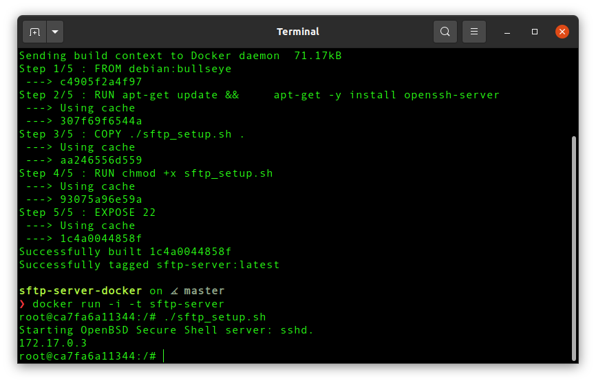
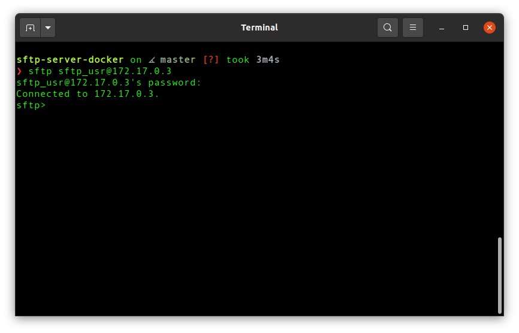

# SFTP server: docker setup

## To test/run

```
git clone https://github.com/maksim-estonia/sftp-server-docker
```

Terminal 1 (sftp-server docker instance)

```
docker build -t sftp-server .
docker run -i -t sftp-server
./sftp_setup.sh
```



Terminal 2 (host computer)

```
sftp sftp_usr@172.17.0.3
```

(password is `sftp`)



## Setup

Dockerfile:

```
FROM debian:bullseye
RUN apt-get update && \
    apt-get -y install openssh-server 
EXPOSE 22
```

build docker image:

```
docker build -t sftp-server .
```

run docker container

```
docker run -i -t sftp-server
```

### SFTP directory

```
mkdir -p /data
chmod 701 /data
```

### Create the SFTP group and user

```
groupadd sftp_users
```

```
useradd -g sftp_users -d /upload -s /sbin/nologin sftp_usr
```

(USERNAME is `sftp_usr` in my case)

Give the new user a password

```
echo "sftp_usr:sftp" | chpasswd
```

(password is `sftp` in my case)

### Create the new user SFTP directory

```
mkdir -p /data/sftp_usr/upload
chown -R root:sftp_users /data/sftp_usr
chown -R sftp_usr:sftp_users /data/sftp_usr/upload
```

### Configure sshd

Add the following to `/etc/ssh/sshd_config`:

```
Match Group sftp_users
ChrootDirectory /data/%u
ForceCommand internal-sftp
```

```
echo "Match Group sftp_users" >> /etc/ssh/sshd_config
echo "ChrootDirectory /data/%u" >> /etc/ssh/sshd_config
echo "ForceCommand internal-sftp" >> /etc/ssh/sshd_config
```

start SSH service

```
service ssh start
```

IP address of `sftp-server` container

```
hostname -I
```

## Connect from host

Now from host computer we can log into sftp-server running inside Docker:

```
sftp sftp_usr@172.17.0.4
```

(password: `sftp`)

## References

[How to set up an SFTP server on Linux](https://www.techrepublic.com/article/how-to-set-up-an-sftp-server-on-linux/)

[How to enable ssh on Debian](https://phoenixnap.com/kb/how-to-enable-ssh-on-debian)

[atmoz/sftp](https://github.com/atmoz/sftp/blob/master/Dockerfile)